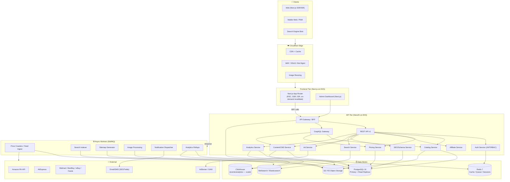

# 1. System Architecture

## 1.1 High-Level Architecture



## 1.2 Architectural Style

- **Modular monolith first, microservice-ready.** Start as a single NestJS app organized into
  bounded **modules** (Catalog, Pricing, Affiliate, Content, SEO, Search, Ads, Analytics, Auth).
  Each module has clean boundaries (controllers → services → repositories) so any module can be
  extracted into its own deployable service when traffic justifies it — without rewrites.
- **BFF (Backend-for-Frontend).** Next.js server components call a thin gateway that aggregates,
  shapes, and localizes responses for the UI, keeping the public REST/GraphQL contract clean.
- **CQRS-lite for read scale.** Heavy read paths (product pages, listings, comparisons) are served
  from Redis + read replicas + search index; writes go to the primary.
- **Event-driven async.** Crawling, indexing, sitemap regen, image processing, notifications, and
  analytics rollups run as idempotent background jobs on Redis/BullMQ.

## 1.3 Request Lifecycles

### A) Product page (read, SEO-critical)
```
Bot/User → Cloudflare (HTML cache, stale-while-revalidate)
         → Next.js (ISR: cached HTML, revalidate=300s, on-demand purge on price change)
         → BFF → Catalog/Pricing service
         → Redis (product:{id}:{country}) hit? serve : query PG read-replica → cache → serve
         → JSON-LD injected server-side (Product + AggregateRating + Breadcrumb)
```

### B) Affiliate click (write + redirect)
```
User clicks "Buy at Amazon"
  → GET /go/{affiliateLinkId}?ctx=...   (NestJS Affiliate service, 302)
  → fire-and-forget enqueue click event (BullMQ) — never block the redirect
  → append affiliate tag + sub-id → 302 to merchant
  → worker persists click (country, device, product, store, EPC attribution) → CH/PG
```

### C) Price ingestion (async)
```
Cron/feed → W1 crawler/feed-parser normalizes price+stock+currency
  → upsert prices, write price_history (append-only, partitioned by month)
  → if price changed: invalidate Redis + trigger Next.js on-demand revalidate + reindex search
  → if price drop watched: enqueue notification
```

## 1.4 Multi-Region / International Strategy
- **Single global catalog**, per-country **pricing, ads, affiliate links, SEO pages** (see
  localization tables). Country resolved by `Cf-IPCountry` header + user override (cookie).
- **Hreflang clusters** per locale; canonical points to the locale-specific URL.
- Currency display converts via cached FX rates; **stored prices keep the merchant's native
  currency** + a normalized USD column for sorting/analytics.

## 1.5 Non-Functional Targets

| Concern | Target |
|---|---|
| Product page TTFB (cached) | < 200 ms at edge |
| API p95 latency | < 150 ms (cached), < 400 ms (DB) |
| PageSpeed / Lighthouse | ≥ 95 mobile |
| Core Web Vitals | LCP < 2.0s, INP < 200ms, CLS < 0.1 (green) |
| Availability | 99.95% |
| Scale | 10M+ products, 100M+ price rows, 50k RPS read at edge |
| Search latency | < 50 ms autocomplete |
