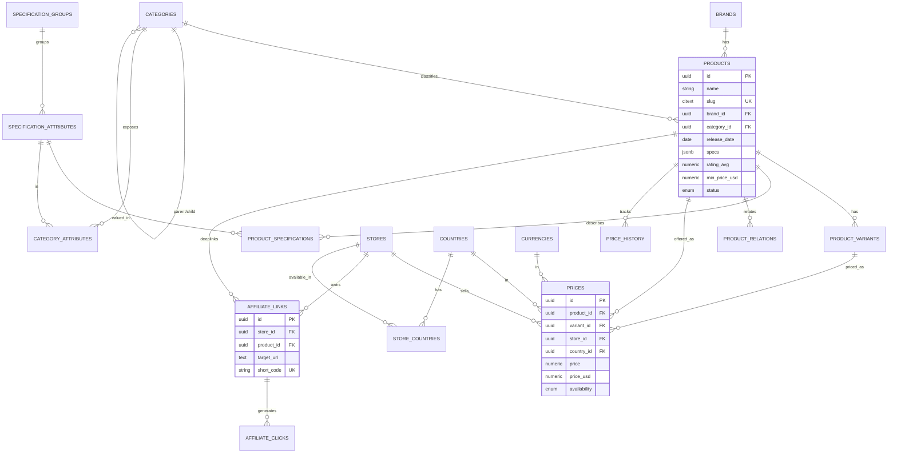
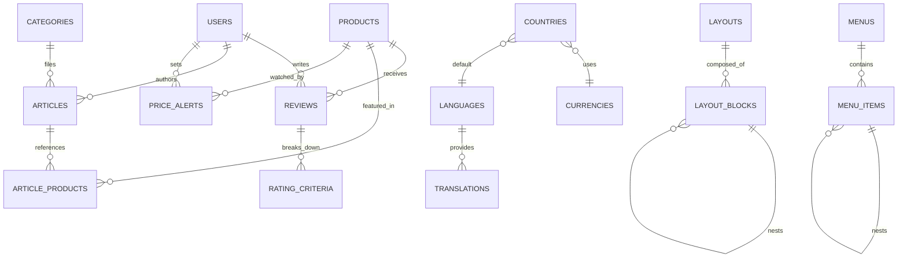
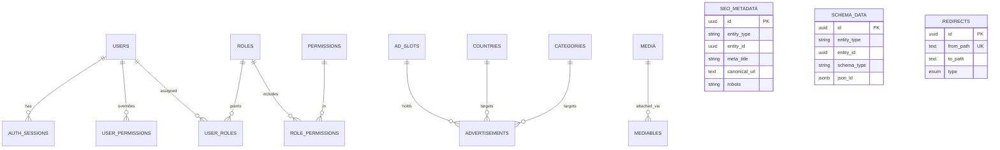

# 3. ER Diagram

> Rendered with Mermaid (`erDiagram`). Core entities and cardinalities. Polymorphic attach tables
> (`seo_metadata`, `schema_data`, `mediables`, `taggables`, `translations`) connect to many
> entities via `(entity_type, entity_id)` and are shown once.

## 3.1 Catalog + Commerce Core

## 3.2 Reviews, Content & Localization

## 3.3 Identity, Ads & SEO

## 3.4 Legend

- `||--o{` one-to-many, `}o--||` many-to-one, `||--||` one-to-one.
- **PK** primary key, **FK** foreign key, **UK** unique key.
- Tables not drawn but present: `tags`/`taggables`, `media`/`mediables`, `settings`,
  `notifications`, `activity_logs`, `seo_hreflangs`, `pages` — all referenced in §2.
