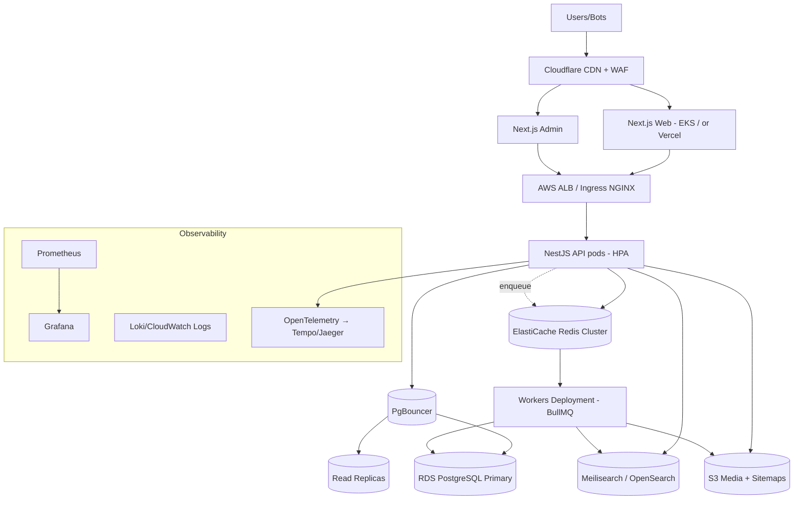

# 12. Deployment Architecture

## 12.1 Environments

| Env | Purpose | Data |
|-----|---------|------|
| **local** | docker-compose: postgres, redis, meilisearch, minio, mailhog | seeded demo |
| **preview** | ephemeral per-PR (Vercel preview for web/admin + namespace for API) | anonymized subset |
| **staging** | production mirror, smaller scale | sanitized copy |
| **production** | multi-AZ, autoscaled | live |

## 12.2 Runtime Topology

## 12.3 Packaging & Orchestration
- **Containers**: multi-stage Dockerfiles (distroless/Alpine runtime) per app; non-root user.
- **Kubernetes (EKS)**: separate Deployments for `api`, `web`, `admin`, `workers`; each with HPA
  (CPU + RPS/queue-depth custom metrics), PodDisruptionBudgets, readiness/liveness probes.
- **Helm** charts per service; values per environment. Config via ConfigMaps; secrets via External
  Secrets Operator → AWS Secrets Manager.
- **Frontend option**: deploy `web`/`admin` to **Vercel** (best-in-class Next.js ISR/edge) OR run
  on EKS for single-cloud control. Both supported; pick per ops preference.

## 12.4 Release Strategy
- **Blue/green or canary** rollouts (Argo Rollouts): shift 5% → 25% → 100% with automatic rollback
  on error-rate/latency SLO breach.
- **Zero-downtime DB migrations**: expand/contract pattern (add columns → backfill → switch reads →
  drop old) so schema changes never break running pods. Migrations run as a pre-deploy Job.
- Feature flags (Unleash/Flagsmith) decouple deploy from release.

## 12.5 Scaling Behavior
- API: HPA target ~60% CPU + p95 latency guard; min 3 / max N replicas across 3 AZs.
- Workers: KEDA scales on Redis queue depth (scale-to-many during nightly crawls, near-zero idle).
- DB: vertical scale primary + add read replicas; later shard hottest tables (§15).
- Stateless app tier → horizontal scale is the default lever.

## 12.6 Backups & DR
- RDS automated backups + PITR (35-day retention) + cross-region snapshot copy.
- S3 versioning + cross-region replication for media/sitemaps.
- Redis: persistence (AOF) for queues; cache is reconstructable.
- **RPO ≤ 5 min, RTO ≤ 1 h**. DR runbook with regular restore drills; warm standby region (§13).

## 12.7 Health, Rollback, Runbooks
- `/healthz` (liveness), `/readyz` (deps check). Synthetic checks (uptime + key user journeys).
- One-command rollback (`helm rollback` / Argo undo). Documented runbooks for: DB failover, cache
  flush, search reindex, sitemap regen, FX outage, affiliate network outage.
