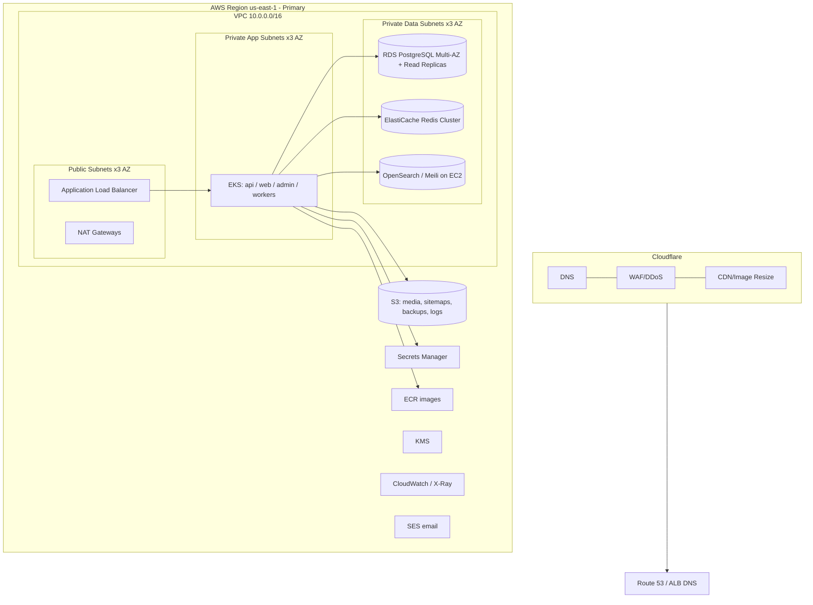

# 13. AWS Infrastructure Design

All infrastructure is **Terraform-managed** (`infra/terraform`), multi-AZ, with a warm standby
region for DR. Cloudflare sits in front of AWS for CDN/WAF/DNS.

## 13.1 Topology

## 13.2 Core Services

| Concern | AWS Service | Notes |
|---------|-------------|-------|
| Compute | **EKS** (managed node groups + Fargate for bursty workers) | 3-AZ, autoscaling, Karpenter |
| Container registry | **ECR** | image scanning on push |
| Primary DB | **RDS PostgreSQL 16, Multi-AZ** | + 2+ read replicas; `db.r6g` graviton |
| Connection pool | **RDS Proxy** / PgBouncer sidecar | tame connection storms |
| Cache/Queue | **ElastiCache for Redis (cluster mode)** | replicas per shard |
| Search | **OpenSearch** (or Meilisearch on EC2/EKS for cost) | dedicated data nodes |
| Object storage | **S3** | media, sitemaps, backups, log archive; lifecycle to Glacier |
| Edge/CDN/WAF | **Cloudflare** (+ S3 origin) | image resizing, caching |
| DNS | **Route 53** (or Cloudflare DNS) | health-checked failover |
| Secrets | **Secrets Manager** + **KMS** | rotation, encryption keys |
| Email/SMS | **SES** + Twilio/SNS | alerts, newsletters, OTP |
| Analytics lake | **ClickHouse on EC2** or **Athena over S3 (Parquet)** | clicks/events at scale |
| Observability | **CloudWatch, X-Ray** + Prometheus/Grafana/Loki/Tempo on EKS | metrics/logs/traces |
| IaC | **Terraform** + remote state in S3 + DynamoDB lock | per-env workspaces |

## 13.3 Networking
- VPC with public / private-app / private-data subnet tiers across **3 AZs**.
- NAT gateways for egress from private subnets; VPC endpoints (S3, ECR, Secrets Manager) to avoid
  NAT cost and keep traffic on AWS backbone.
- Security groups least-privilege; data tier reachable only from app tier SGs.
- WAF + Shield (via Cloudflare primarily; AWS WAF on ALB as defense-in-depth).

## 13.4 Storage Lifecycle
- S3 buckets: `media` (versioned, CRR), `sitemaps` (public-read via CDN), `backups`
  (Glacier transition after 90d), `logs` (Athena-queryable, expire 1y).
- RDS automated backups + manual snapshots before migrations; cross-region snapshot copy.

## 13.5 Cost Optimization
- **Graviton (arm64)** instances for EKS nodes + RDS (price/perf).
- **Karpenter** for right-sized, spot-heavy worker capacity; on-demand for API baseline.
- ElastiCache + RDS reserved/savings plans for steady state.
- Cloudflare offloads bandwidth/egress (major savings vs CloudFront for this read-heavy workload).
- S3 Intelligent-Tiering; lifecycle to Glacier for cold price-history archives.

## 13.6 Multi-Region / DR
- **Primary**: us-east-1. **Warm standby**: eu-west-1 (or closest to top traffic).
- Cross-region: RDS read replica (promotable), S3 CRR, ECR replication, Route 53 health-check failover.
- For global low-latency reads, the **edge (Cloudflare) + ISR** already serves cached HTML near
  users; only writes hit the primary region. Future active-active is addressed in §15.

## 13.7 IAM & Governance
- IRSA (IAM Roles for Service Accounts) — pods get scoped AWS permissions, no static keys.
- Separate AWS accounts per environment (Org + SCPs); CloudTrail org-wide; Config rules; GuardDuty.
- Tagging policy (env, service, cost-center) for cost allocation + automation.
