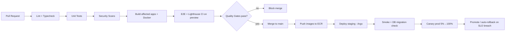

# 14. CI/CD Pipeline

GitHub Actions (or GitLab CI) driving a **monorepo-aware** pipeline (Turborepo remote cache → only
affected apps build/test). GitOps deploy via Argo CD.

## 14.1 Pipeline Stages



## 14.2 CI Jobs (on every PR)
- **Affected detection**: `turbo run ... --filter=...[origin/main]` builds/tests only changed apps.
- **Lint + format**: ESLint, Prettier, `tsc --noEmit` across packages.
- **Unit tests**: Vitest/Jest (API services, schema-ld builders, UI components) — coverage gate.
- **Contract tests**: OpenAPI/GraphQL schema diff; fail on breaking change without version bump.
- **Security**: CodeQL/Semgrep (SAST), Trivy (image + deps), tfsec/Checkov (IaC), gitleaks (secrets).
- **DB migration check**: spin ephemeral Postgres, run migrations up+down, validate against schema.sql.
- **Preview deploy**: per-PR ephemeral env (web/admin preview + API namespace) with seeded data.
- **E2E**: Playwright on preview (key journeys: product page, compare, search, affiliate redirect).
- **Lighthouse CI**: budget gate — fail PR if mobile perf < 95 or CWV regress (LCP/INP/CLS).

## 14.3 CD (on merge to main)
- Build + push immutable images to ECR (tagged with git SHA), signed with cosign.
- Argo CD syncs Helm charts → **staging** automatically; runs smoke + migration job.
- Manual approval (or auto on green) → **production canary** via Argo Rollouts.
- Automatic rollback if Prometheus SLO (error rate / p95 latency) breached during canary.
- Post-deploy: warm caches, trigger sitemap regen if needed, notify Slack.

## 14.4 Example Workflow (excerpt)

```yaml
name: ci
on: { pull_request: {}, push: { branches: [main] } }
concurrency: { group: ci-${{ github.ref }}, cancel-in-progress: true }
jobs:
  build-test:
    runs-on: ubuntu-latest
    steps:
      - uses: actions/checkout@v4
      - uses: pnpm/action-setup@v4
      - uses: actions/setup-node@v4
        with: { node-version: 22, cache: pnpm }
      - run: pnpm install --frozen-lockfile
      - run: pnpm turbo run lint typecheck test build --filter=...[origin/main]
      - run: pnpm turbo run lighthouse --filter=web   # budget gate
  security:
    runs-on: ubuntu-latest
    steps:
      - uses: actions/checkout@v4
      - uses: github/codeql-action/analyze@v3
      - run: trivy fs --exit-code 1 --severity HIGH,CRITICAL .
      - run: gitleaks detect --no-banner
  docker-deploy:
    needs: [build-test, security]
    if: github.ref == 'refs/heads/main'
    runs-on: ubuntu-latest
    steps:
      - uses: aws-actions/configure-aws-credentials@v4   # OIDC, no static keys
        with: { role-to-assume: ${{ secrets.DEPLOY_ROLE_ARN }}, aws-region: us-east-1 }
      - run: ./scripts/build-and-push.sh   # build affected, push to ECR
      - run: ./scripts/argocd-sync.sh staging
```

## 14.5 Quality Gates (merge blockers)
- ✅ All tests pass, coverage ≥ threshold
- ✅ No HIGH/CRITICAL vulns (deps, image, code)
- ✅ No secrets detected
- ✅ Lighthouse mobile ≥ 95, CWV green
- ✅ No un-versioned breaking API change
- ✅ Migrations reversible & validated
- ✅ Required reviews + CODEOWNERS approval

## 14.6 Supply-Chain & Release Hygiene
- OIDC federation to AWS (no long-lived keys); least-privilege deploy role.
- SBOM generation (Syft) + provenance attestation (SLSA) per image; cosign verification at admission.
- Renovate/Dependabot for automated, tested dependency PRs.
- Semantic versioning + auto-generated changelogs; immutable, SHA-pinned image tags in prod.
